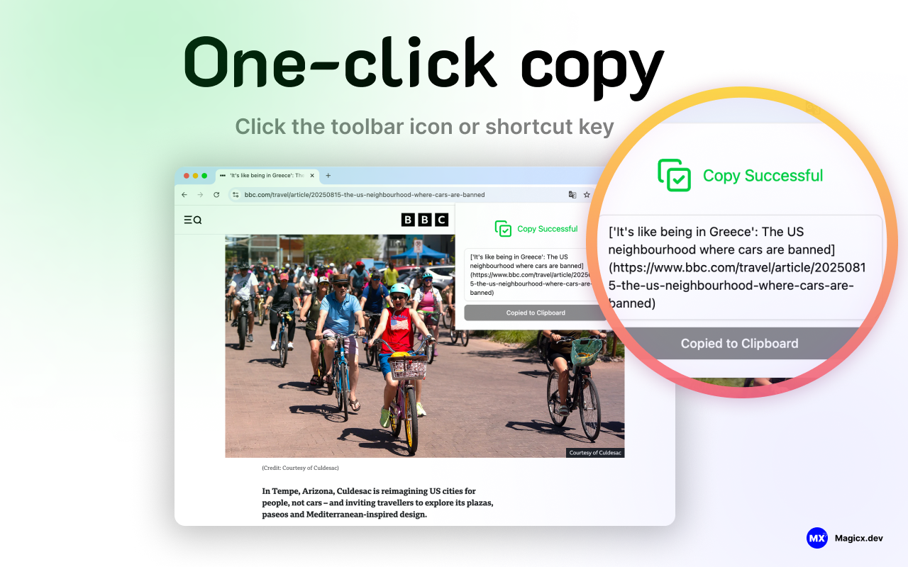

 

<a href="https://github.com/magicx-dev/copyref-extension"> CopyRef </a> 是一款开源的浏览器扩展工具，旨在帮助用户快速复制当前标签页的 URL，并以 Markdown 格式生成引用链接，方便在笔记、文档和博客中使用。

 

<a href="./README.md">🇬🇧English</a> | <a href="./README.zh-CN.md">🇨🇳简体中文</a>

## 功能特点

- **快速复制**：一键获取当前标签页 URL。
- **Markdown 格式支持**：自动生成 `[标题](URL)` 格式的链接，方便在笔记、文档和博客中使用。  
- **轻量高效**：扩展小巧，加载快速，无侵入页面内容。  
- **开源安全**：插件代码完全开源，可自行下载安装。  

## 项目组件

* [WXT](https://wxt.dev/) - 浏览器扩展框架
* [Tailwind CSS](https://tailwindcss.com/) - 高效的样式工具
* [Shadcn for Vue](https://www.shadcn-vue.com/) - UI 组件库

## 安装

* [Chrome Web Store](https://chromewebstore.google.com/detail/mjhijlbeoapccmbjicfnhgijfkpjggbe)（提交与上线 2025-08-21，不到 12 小时）

## 开发与贡献

欢迎开发者贡献代码或提出建议。你可以通过 Fork 项目、提交 Issue 或 Pull Request 来参与开发。
